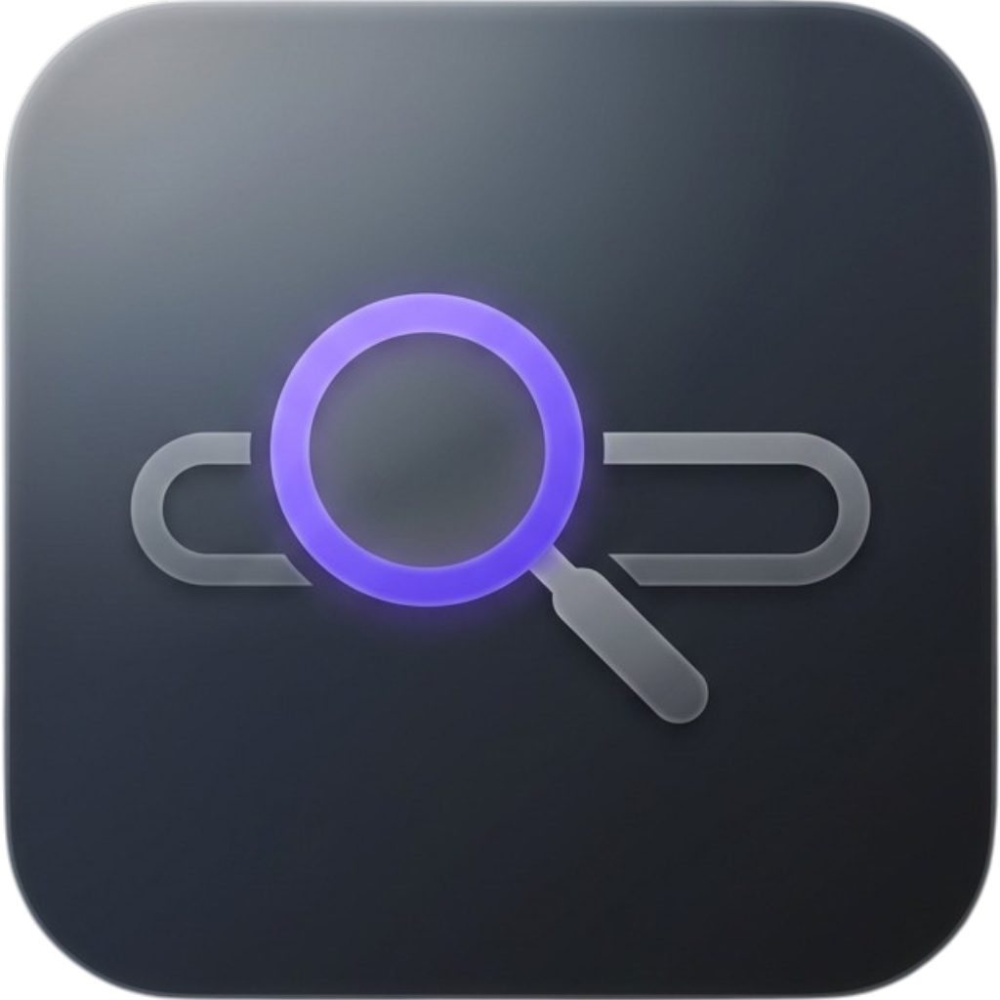
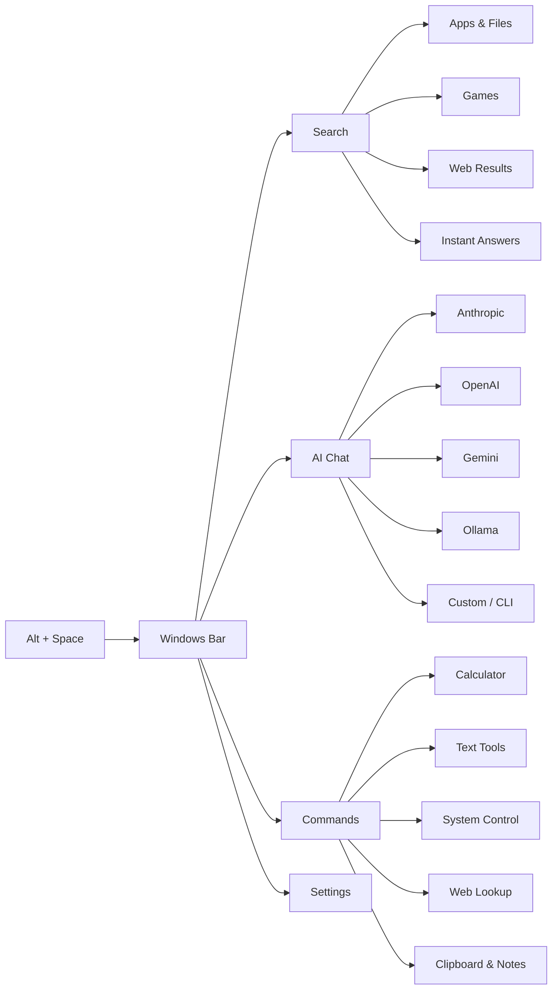
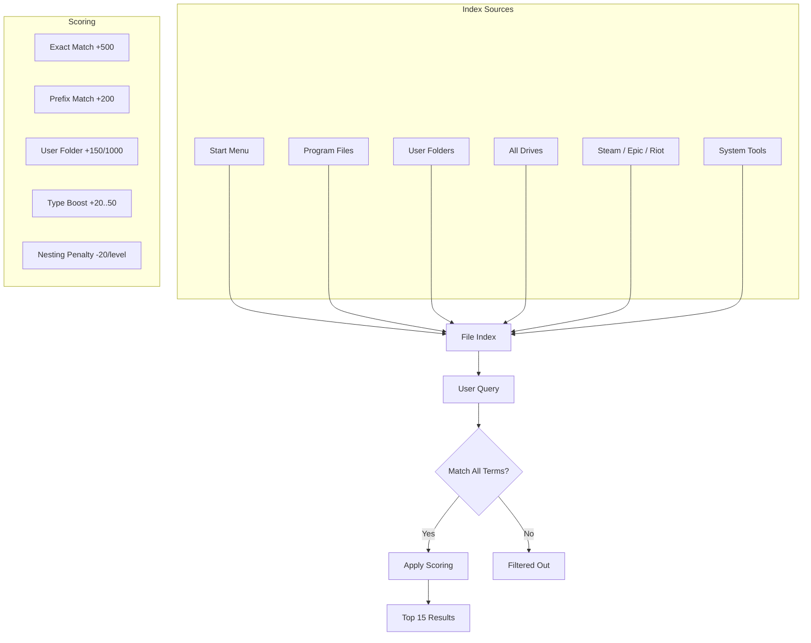
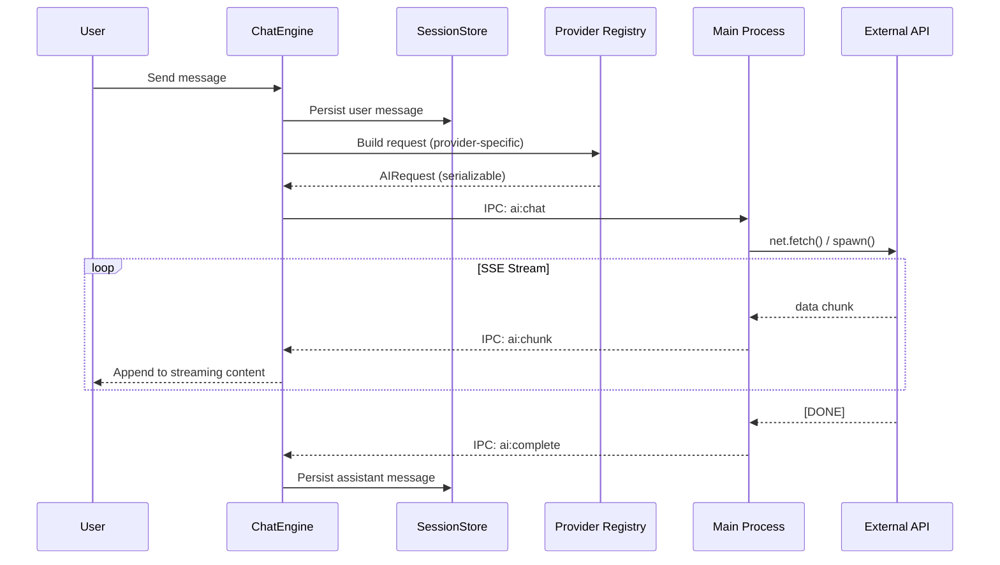
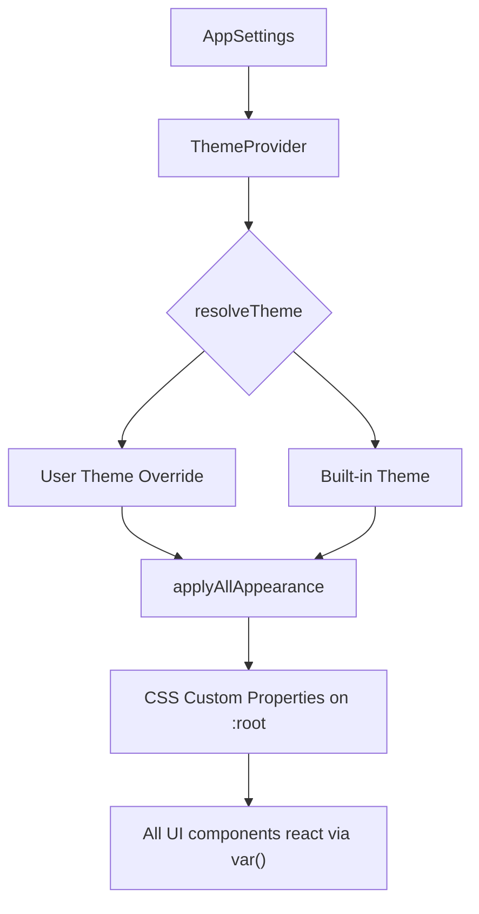
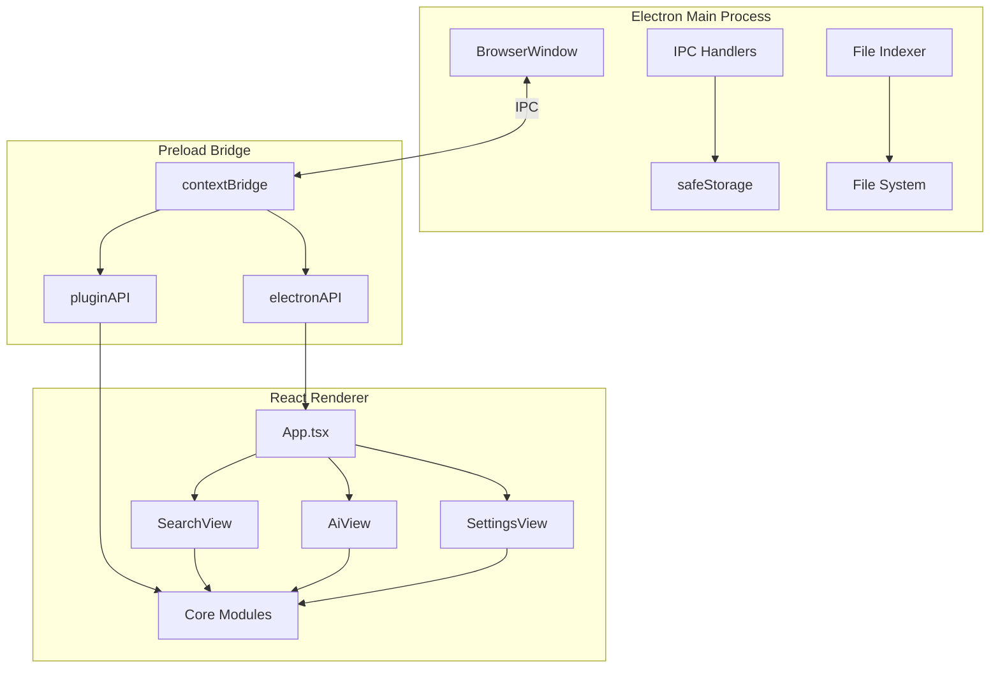
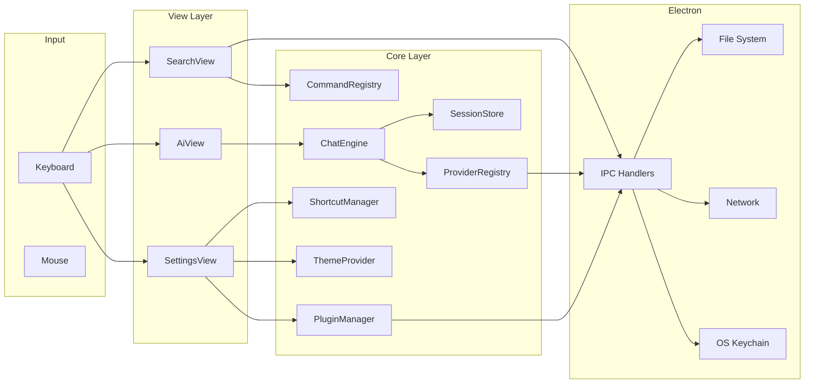

<div align="center">



    
# Windows Bar

**A premium productivity launcher for Windows.**

Blazing-fast app search, multi-provider AI chat, 40+ built-in commands, and deep system integration — all in a single keystroke.

[]()
[]()
[]()
[]()
[]()

</div>

---

## Overview

Windows Bar is an always-on-top desktop launcher inspired by macOS Spotlight and Raycast. Toggle it with **Alt+Space**, search for apps, files, games, run commands, or chat with AI — then it gets out of your way.



---

## Features

### Universal Search

Search across your entire system from a single input. Results are scored with a weighted relevance algorithm that prioritizes user folders, exact matches, and item type.



**Indexed locations:**
- Start Menu, Program Files (x86/x64), user folders (Desktop, Downloads, Documents, Pictures, Videos, Music)
- Steam libraries (multi-library via `libraryfolders.vdf`), Epic Games, Riot Games
- All mounted drives (C:–H:), root-level crawling (depth 2)
- 10 hardcoded system tools (Settings, Task Manager, Registry Editor, etc.)

**Game detection** parses Steam `appmanifest_*.acf` files to extract app IDs, names, and main executables — launches via `steam://rungameid/` protocol.

### AI Chat

Integrated multi-provider chat with streaming responses, session persistence, and OS-level credential storage.



**Supported providers:**

| Provider | Type | Models |
|----------|------|--------|
| Anthropic | API (SSE) | Claude Sonnet 4.6, Opus 4.6, Haiku 4.5 |
| OpenAI | API (SSE) | GPT-4o, GPT-4o-mini, o3-mini |
| Google Gemini | API (SSE) | Gemini 2.0 Pro, 2.0 Flash |
| Ollama | API (local) | Llama 3, Mistral, Code Llama |
| Custom | API (OpenAI-compatible) | User-defined |
| CLI | Shell process | Any terminal AI tool |

**Security:** API keys are encrypted via Electron `safeStorage` (OS keychain) — they never touch localStorage or the renderer process unencrypted.

**Session management:** Up to 50 chat sessions persisted in localStorage with auto-titling, search, and bulk delete.

### Built-in Commands

Over 40 commands across 8 categories, invoked with `/` prefix directly in the search bar.

| Category | Commands |
|----------|----------|
| **Calculator** | `/calc`, `/uuid`, `/now`, `/ts`, `/random`, `/pass`, `/hash`, `/color`, `/lorem`, `/bin`, `/hex`, `/age`, `/days`, `/week`, `/len` |
| **Text** | `/enc`, `/dec`, `/json`, `/rev`, `/upper`, `/lower`, `/url`, `/unurl` |
| **Web** | `/qr`, `/ip`, `/wiki`, `/tr` |
| **Notes** | `/note`, `/notes`, `/clear-notes` |
| **Clipboard** | `/cp`, `/history` |
| **System** | `/sys`, `/proc`, `/kill`, `/run` |
| **Power** | `/sleep`, `/mute`, `/trash`, `/ss`, `/lock`, `/shutdown`, `/restart` |

### Themes & Customization

8 built-in themes with full CSS variable control. Every visual aspect is configurable — accent color, blur radius, border radius, font family, transparency, compact mode, and more.



| Theme | Style |
|-------|-------|
| Dark Default | Standard dark |
| Dark Purple | Purple accent dark |
| Ocean Blue | Blue-tinted dark |
| Light | Clean light |
| Warm Light | Warm-toned light |
| Nord | Nord palette |
| Dracula | Dracula palette |
| Catppuccin Mocha | Catppuccin palette |

---

## Architecture

### High-Level



### Module Map

```
Windows-Bar/
├── electron/                    # Main process
│   ├── main.ts                  #   Window creation, IPC handlers, file indexer
│   ├── preload.ts               #   contextBridge → electronAPI + pluginAPI
│   ├── utils/icons.ts           #   Icon extraction (base64, getFileIcon, Steam)
│   └── indexers/
│       ├── types.ts             #   IndexItem, extension sets, skip lists
│       └── steam.ts             #   VDF parser, appmanifest reader
│
├── src/
│   ├── App.tsx                  # Root: view routing, settings, appearance
│   ├── main.tsx                 # React entry point
│   ├── types.ts                 # Central type definitions
│   ├── preload.d.ts             # API type declarations
│   │
│   ├── core/
│   │   ├── ai/
│   │   │   ├── types.ts         #     AIModel, ChatMessage, AIProvider, AIRequest
│   │   │   ├── chat.ts          #     ChatEngine (single conversation state)
│   │   │   ├── sessions.ts      #     SessionStore (localStorage, max 50)
│   │   │   └── providers/
│   │   │       ├── registry.ts  #     ProviderRegistry singleton
│   │   │       ├── openai.ts    #     OpenAI GPT-4o/o3-mini
│   │   │       ├── anthropic.ts #     Claude Sonnet/Opus/Haiku
│   │   │       ├── gemini.ts    #     Gemini 2.0 Pro/Flash
│   │   │       ├── ollama.ts    #     Local Llama/Mistral
│   │   │       ├── cli.ts       #     Shell command provider
│   │   │       └── custom.ts    #     OpenAI-compatible custom endpoint
│   │   │
│   │   ├── commands/
│   │   │   ├── registry.ts      #     CommandRegistry singleton
│   │   │   └── builtin/         #     8 command modules (~40 commands)
│   │   │
│   │   ├── plugins/
│   │   │   ├── types.ts         #     PluginContext, PluginModule interfaces
│   │   │   └── manager.ts       #     PluginManager (install/uninstall/toggle)
│   │   │
│   │   ├── settings/
│   │   │   └── themes.ts        #     8 built-in themes, applyTheme()
│   │   │
│   │   └── shortcuts/
│   │       ├── defaults.ts      #     9 default bindings
│   │       └── manager.ts       #     ShortcutManager (match, conflicts, format)
│   │
│   ├── views/
│   │   ├── SearchView.tsx       #   Main search: input, results, commands, weather
│   │   ├── AiView.tsx           #   AI chat: streaming, history, provider config
│   │   ├── SettingsView.tsx     #   Settings: 9 categories with live preview
│   │   └── ai/
│   │       ├── ChatInput.tsx    #     Auto-resize textarea, Enter/Shift+Enter
│   │       ├── ChatMessage.tsx  #     Markdown bubbles, code blocks, copy
│   │       ├── ChatMessages.tsx #     Scrollable list, auto-scroll, streaming
│   │       ├── ChatToolbar.tsx  #     Back, rename, model badge, actions
│   │       ├── HistoryModal.tsx #     Session search, keyboard nav, bulk delete
│   │       ├── ProviderModal.tsx#     Provider config, API keys, test connection
│   │       └── OnboardingCard.tsx # First-time provider setup
│   │
│   ├── components/
│   │   ├── ThemeProvider.tsx    #   React context: theme resolution + CSS vars
│   │   └── ConfirmDialog.tsx    #   Custom confirm dialog with keyboard nav
│   │
│   └── styles/
│       ├── base.css             #   CSS variables, glassmorphism, animations
│       ├── search.css           #   Search input, results, commands, weather
│       ├── ai.css               #   Chat UI, messages, code blocks, modals
│       └── settings.css         #   Settings panels, toggles, theme grid
│
└── resources/
    ├── icon.png                 # App icon
    └── es.exe                   # Everything search binary
```

### IPC Bridge

The preload script exposes two typed APIs to the renderer:

**`electronAPI`** — 25+ methods for window control, search, system info, clipboard, AI chat, and credential storage.

**`pluginAPI`** — 4 methods for plugin lifecycle management (list, install, uninstall, toggle).

All IPC is typed in `src/preload.d.ts` for full TypeScript safety across the process boundary.

### Data Flow



---

## Keyboard Shortcuts

All views are fully keyboard-navigable with rebindable shortcuts and focus zones.

| Shortcut | Action | Context |
|----------|--------|---------|
| `Alt + Space` | Toggle window | Global |
| `↑` / `↓` | Navigate results | Search |
| `Enter` | Execute selected | Search |
| `Tab` / `Shift + Tab` | Cycle focus zones | Search (4 zones) |
| `Ctrl + Tab` | Toggle web suggestions | Search |
| `Ctrl + I` | Open AI chat | Global |
| `Ctrl + ,` | Open settings | Global |
| `Ctrl + N` | New chat | AI |
| `Ctrl + H` | Chat history | AI |
| `Ctrl + P` | Provider settings | AI |
| `Ctrl + L` | Focus chat input | AI |
| `Escape` | Close / Go back | Global |

---

## Setup

### Prerequisites

- Windows 10 or 11
- [Bun](https://bun.sh/) (preferred) or Node.js 18+

### Development

```bash
git clone https://github.com/JackyWein/Windows-Bar.git
cd Windows-Bar
bun install
bun run dev
```

### Production Build

```bash
bun run build
```

Outputs an NSIS installer to `dist/`.

---

## Extensibility

### Plugin System

Plugins are directory-based packages with a `manifest.json` and a JavaScript entry point. The infrastructure for install, uninstall, and toggle is in place.

```json
{
  "id": "my-plugin",
  "name": "My Plugin",
  "version": "1.0.0",
  "description": "Does something useful",
  "author": "you",
  "main": "index.js"
}
```

```typescript
// Plugin entry point (index.js)
module.exports = {
  activate(context) {
    context.registerCommand({
      id: 'my-cmd',
      trigger: '/my',
      handler: (args, ctx) => ({ results: [] })
    });
  },
  deactivate() {}
};
```

Plugins are stored in `%APPDATA%/plugins/` and can register custom commands, settings, and IPC handlers.

### Custom AI Providers

Any OpenAI-compatible API endpoint can be added as a custom provider directly from the settings UI — no code changes required. Local endpoints (localhost/127.0.0.1) work without an API key.

### Custom Themes

Themes are defined as plain objects mapping CSS variable names to color values. Add new themes to `src/core/settings/themes.ts`:

```typescript
{
  id: 'my-theme',
  name: 'My Theme',
  type: 'dark',
  colors: {
    bg: '#0a0a0f',
    surface: '#14141f',
    border: 'rgba(255,255,255,0.06)',
    text: '#e0e0e8',
    textMuted: '#6b6b80',
    accent: '#ff6b6b',
    accentHover: '#ff5252',
    app: '#c084fc',
    game: '#4ade80',
    file: '#60a5fa',
    web: '#fb923c',
    system: '#94a3b8',
  }
}
```

---

## Tech Stack

| Layer | Technology |
|-------|-----------|
| Desktop framework | Electron 41 |
| UI framework | React 19 |
| Language | TypeScript 5.9 (strict) |
| Build tool | Vite 8 |
| Icons | Lucide React |
| Markdown | react-markdown + remark-gfm + rehype-highlight |
| Packaging | electron-builder (NSIS) |
| Runtime | Bun (preferred), Node.js 18+ |

---

## Known Issues

- Some file type icons may fall back to defaults depending on the file association
- Plugin loading and activation is not yet fully implemented (infrastructure only)

## Roadmap

- [ ] Plugin loading engine (evaluate entry points, call activate/deactivate)
- [ ] Settings UI for index configuration (custom folders, exclusions)
- [ ] Natural language command parsing
- [ ] Window management commands (snap, move, resize)
- [ ] Scripting API for advanced automation

---

## License

MIT — see [LICENSE](LICENSE) for details.
